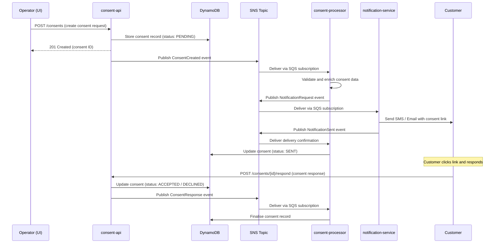
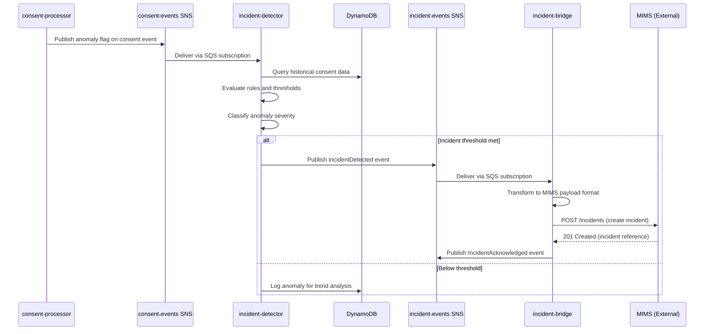

# Consent Management System -- Architecture Design Document

> **Version:** 1.0
> **Last Updated:** 2026-08-30

---

## Table of Contents

1. [Introduction](#1-introduction)
2. [System Overview](#2-system-overview)
3. [Microservices](#3-microservices)
4. [Technology Stack](#4-technology-stack)
5. [Communication Patterns](#5-communication-patterns)
6. [Data Flow Diagrams](#6-data-flow-diagrams)
7. [Service Dependencies](#7-service-dependencies)
8. [Scalability](#8-scalability)
9. [Resilience](#9-resilience)
10. [Security Considerations](#10-security-considerations)

---

## 1. Introduction

### Purpose

The Consent Management System (CMS) is a platform designed to collect, track, and manage consent from customers through SMS and Email channels. It provides a unified interface for operators to create consent requests, monitor their status, and handle edge cases such as customer non-response or anomalous behaviour.

### Core Objectives

- **Consent Collection**: Send consent requests to customers via SMS and Email, capture their responses, and maintain an auditable record of all consent interactions.
- **Incident Integration**: Integrate with an external **Major Incident Management System (MIMS)** for automated incident handling when anomalies are detected in consent processing workflows.
- **Event-Driven Architecture**: Built as a set of loosely coupled, event-driven microservices that communicate asynchronously through message queues and topics.
- **Local Kubernetes Deployment**: All services are containerised and deployed on a local Kubernetes cluster (Minikube or K3s), with AWS-compatible services provided by Floci/LocalStack for local development.

### Scope

This document describes the high-level architecture, service decomposition, communication patterns, data flows, and operational characteristics of the Consent Management System.

---

## 2. System Overview

The system comprises six microservices, a React-based frontend, and a set of AWS-compatible infrastructure services provided by Floci (LocalStack). All inter-service communication flows through SNS topics and SQS queues, ensuring loose coupling and resilience.

### Architecture Diagram

```
+------------------------------------------------------------------------------------+
|                              Kubernetes Cluster (Minikube / K3s)                   |
|                                                                                    |
|  +-----------------+          +------------------+                                 |
|  |                 |  REST    |                  |                                 |
|  |   consent-ui    +--------->|   consent-api    |                                 |
|  |  (React 19 +   |  :8000   |  (FastAPI)       |                                 |
|  |   MUI v7)      |          |                  |                                 |
|  |   :3000        |          +--------+---------+                                 |
|  +-----------------+                   |                                           |
|                                        | Publish                                  |
|                                        v                                           |
|                               +--------+---------+                                 |
|                               |                  |                                 |
|                               |  SNS Topics      |                                 |
|                               |  (consent-       |                                 |
|                               |   events, etc.)  |                                 |
|                               +--+----+----+---+-+                                 |
|                                  |    |    |   |                                   |
|                     +------------+    |    |   +------------+                      |
|                     |                 |    |                |                      |
|                     v                 v    v                v                      |
|  +------------------+--+  +----------+-+  +-+-----------+  +-------------------+  |
|  |                     |  |            |  |             |  |                   |  |
|  | consent-processor   |  | notif-     |  | incident-   |  | incident-bridge   |  |
|  | (FastAPI)           |  | service    |  | detector    |  | (FastAPI)         |  |
|  | :8001               |  | (FastAPI)  |  | (FastAPI)   |  | :8004             |  |
|  |                     |  | :8002      |  | :8003       |  |                   |  |
|  +----------+----------+  +-----+------+  +------+------+  +---------+---------+  |
|             |                   |                |                    |             |
|             |                   |                |                    |             |
|             |                   | SMS / Email    |                    |  REST/HTTP  |
|             |                   v                |                    v             |
|             |            +-----------+           |          +------------------+   |
|             |            | Customers |           |          |                  |   |
|             |            | (SMS /    |           |          |  MIMS (External) |   |
|             |            |  Email)   |           |          |  Major Incident  |   |
|             |            +-----------+           |          |  Mgmt System     |   |
|             |                                    |          +------------------+   |
|             +------------------------------------+                                 |
|              (anomaly detection triggers incident flow)                            |
|                                                                                    |
|  +-----------------------------------------------------------------------------+  |
|  |                     Floci (LocalStack) :4566                                 |  |
|  |                                                                              |  |
|  |   +----------+  +---------+  +---------+  +---------+  +---------+          |  |
|  |   | DynamoDB |  |   SNS   |  |   SQS   |  |   SES   |  |   S3    |          |  |
|  |   +----------+  +---------+  +---------+  +---------+  +---------+          |  |
|  +-----------------------------------------------------------------------------+  |
+------------------------------------------------------------------------------------+
```

### Key Design Decisions

- **Event-Driven**: All inter-service communication uses SNS/SQS, making services independently deployable and scalable.
- **Floci/LocalStack**: AWS services are emulated locally via Floci on port 4566, enabling full-stack local development without cloud dependencies.
- **Single Cluster**: All services run within a single Kubernetes cluster for simplicity in local and development environments.

---

## 3. Microservices

The system is decomposed into six microservices, each responsible for a single domain concern.

| Service                | Technology         | Port  | Description                                                                                         |
|------------------------|--------------------|-------|-----------------------------------------------------------------------------------------------------|
| **consent-ui**         | React 19 + MUI v7  | 3000  | Frontend single-page application (SPA). Provides the operator interface for creating, viewing, and managing consent requests. Communicates exclusively with consent-api via REST. |
| **consent-api**        | Python / FastAPI    | 8000  | Core API service. Exposes RESTful endpoints for consent CRUD operations, stores consent records in DynamoDB, and publishes consent events to SNS topics.                        |
| **consent-processor**  | Python / FastAPI    | 8001  | Background processing service. Consumes consent events from SQS, orchestrates the consent workflow, triggers notifications, and detects anomalies for incident escalation.      |
| **notification-service** | Python / FastAPI  | 8002  | Notification dispatch service. Consumes notification requests from SQS and sends SMS and Email messages to customers via SES. Publishes delivery status events back to SNS.     |
| **incident-detector**  | Python / FastAPI    | 8003  | Anomaly detection service. Consumes consent events from SQS, evaluates configurable rules and thresholds, and publishes incident events to SNS when anomalies are detected.     |
| **incident-bridge**    | Python / FastAPI    | 8004  | MIMS integration bridge. Consumes incident events from SQS, transforms them into MIMS-compatible payloads, and forwards them to the external Major Incident Management System via REST. Also receives commands from MIMS (e.g., pause consent processing). |

### Service Responsibilities

```
consent-ui           --> Operator dashboard, consent form, status tracking
consent-api          --> REST API, validation, persistence, event publishing
consent-processor    --> Workflow orchestration, state machine, anomaly flagging
notification-service --> SMS/Email dispatch via SES, delivery tracking
incident-detector    --> Rule evaluation, threshold monitoring, anomaly classification
incident-bridge      --> MIMS protocol translation, bidirectional sync
```

---

## 4. Technology Stack

### Application Layer

| Technology    | Version / Details     | Purpose                                                    |
|---------------|-----------------------|------------------------------------------------------------|
| Python        | 3.12                  | Runtime for all backend microservices                      |
| FastAPI       | Latest                | Async web framework for REST APIs and background workers   |
| React         | 19                    | Frontend UI library                                        |
| MUI (Material UI) | v7               | React component library for consistent UI design           |
| Pydantic      | v2                    | Data validation and serialisation for API contracts        |
| aioboto3      | Latest                | Async AWS SDK client for DynamoDB, SNS, SQS, SES, S3      |
| structlog     | Latest                | Structured logging across all Python services              |

### Infrastructure Layer

| Technology    | Details               | Purpose                                                    |
|---------------|-----------------------|------------------------------------------------------------|
| DynamoDB      | Via Floci / LocalStack | Primary data store for consent records and metadata        |
| SNS           | Via Floci / LocalStack | Publish/subscribe messaging for event distribution         |
| SQS           | Via Floci / LocalStack | Message queuing for reliable async processing              |
| SES           | Via Floci / LocalStack | Email delivery service                                     |
| S3            | Via Floci / LocalStack | Object storage for attachments and audit logs              |
| Floci         | Port 4566             | LocalStack-compatible AWS service emulator for local dev   |
| LocalStack    | Community edition     | AWS cloud emulation framework (underlying Floci)           |

### Platform Layer

| Technology    | Details               | Purpose                                                    |
|---------------|-----------------------|------------------------------------------------------------|
| Minikube      | Local cluster         | Local Kubernetes cluster for development                   |
| K3s           | Lightweight K8s       | Lightweight Kubernetes distribution for CI/staging         |
| Docker        | Container runtime     | Container packaging and runtime for all services           |
| Helm          | v3                    | Kubernetes package manager for service deployment charts   |

---

## 5. Communication Patterns

### Synchronous Communication

**REST/HTTP** is used exclusively at the system boundary:

- **consent-ui** communicates with **consent-api** over HTTP REST (port 8000).
- **incident-bridge** communicates with the external **MIMS** system over HTTP REST.
- **MIMS** sends commands back to **incident-bridge** via HTTP webhooks.

All internal service-to-service communication is asynchronous.

### Asynchronous Communication

**SNS/SQS** is used for all inter-service communication:

- **SNS Topics** act as event buses. A service publishes an event to a topic, and all interested services receive a copy via their SQS subscription.
- **SQS Queues** provide durable, at-least-once delivery. Each consuming service has its own queue subscribed to the relevant SNS topics.
- This pattern ensures that services are decoupled and can scale independently.

### SNS Topics

| Topic Name                  | Publisher(s)                | Subscriber(s)                                      |
|-----------------------------|-----------------------------|----------------------------------------------------|
| `consent-events`            | consent-api                 | consent-processor, incident-detector               |
| `notification-requests`     | consent-processor           | notification-service                               |
| `notification-status`       | notification-service        | consent-processor                                  |
| `consent-responses`         | consent-api                 | consent-processor, incident-detector               |
| `incident-events`           | incident-detector           | incident-bridge                                    |
| `mims-commands`             | incident-bridge             | consent-processor                                  |

### Consent Request Flow



### Incident Detection Flow



---

## 6. Data Flow Diagrams

### 6.1 Consent Happy Path

The standard flow for a consent request from creation to customer response:

1. **Operator creates consent request** -- The operator fills in the consent form in the consent-ui and submits it.
2. **consent-api validates and stores** -- The consent-api validates the request payload, generates a unique consent ID and response token, and stores the record in DynamoDB with status `PENDING`.
3. **consent-api publishes event** -- A `ConsentCreated` event is published to the `consent-events` SNS topic containing the consent ID, customer details, and channel preference (SMS/Email).
4. **consent-processor picks up event** -- The consent-processor receives the event via its SQS subscription, enriches it with any additional customer data, and prepares the notification payload.
5. **Notification request published** -- The consent-processor publishes a `NotificationRequest` event to the `notification-requests` SNS topic specifying the channel, recipient, and message template.
6. **notification-service sends message** -- The notification-service receives the request, renders the message template with the consent link (containing the response token), and dispatches it via SES (Email) or an SMS gateway.
7. **Delivery confirmation** -- The notification-service publishes a `NotificationSent` event with delivery status. The consent-processor updates the consent record to status `SENT`.
8. **Customer receives and responds** -- The customer receives the SMS or Email, clicks the unique consent link, and submits their response (ACCEPT or DECLINE).
9. **Response captured** -- The consent-api receives the customer response via the public-facing endpoint, validates the response token, and updates the consent record in DynamoDB to status `ACCEPTED` or `DECLINED`.
10. **Response event published** -- A `ConsentResponse` event is published to the `consent-responses` SNS topic. The consent-processor finalises the record and triggers any downstream workflows (e.g., audit logging to S3).

### 6.2 Incident Detection Flow

The flow when an anomaly is detected during consent processing:

1. **Anomaly flagged** -- The consent-processor identifies an anomaly during consent processing (e.g., unusually high failure rate, suspicious response patterns, or timeout spikes) and flags it on the consent event.
2. **incident-detector receives event** -- The incident-detector picks up the flagged event from its SQS subscription to the `consent-events` topic.
3. **Rule evaluation** -- The incident-detector queries historical consent data from DynamoDB and evaluates a configurable set of rules and thresholds (e.g., failure rate > 30% in the last 5 minutes, > 50 timeouts in a window).
4. **Severity classification** -- If rules are triggered, the incident-detector classifies the anomaly severity (LOW, MEDIUM, HIGH, CRITICAL) based on the number and type of rules violated.
5. **Incident event published** -- An `IncidentDetected` event is published to the `incident-events` SNS topic containing the anomaly details, severity, affected consent IDs, and recommended action.
6. **incident-bridge transforms and forwards** -- The incident-bridge receives the incident event, transforms it into the MIMS-compatible payload format (mapping fields, severity levels, and categories), and sends it to the MIMS REST API.
7. **MIMS acknowledgement** -- MIMS acknowledges the incident creation. The incident-bridge publishes an `IncidentAcknowledged` event and stores the MIMS incident reference for correlation.

### 6.3 MIMS Command Flow

The flow when MIMS sends a command back to the Consent Management System:

1. **MIMS issues command** -- An operator in MIMS issues a command related to the consent system (e.g., `PAUSE_CONSENT_PROCESSING`, `RESUME_CONSENT_PROCESSING`, `CANCEL_PENDING_CONSENTS`).
2. **incident-bridge receives webhook** -- MIMS sends the command to the incident-bridge via an HTTP webhook endpoint. The incident-bridge validates the MIMS signature and parses the command payload.
3. **Command event published** -- The incident-bridge publishes a `MIMSCommand` event to the `mims-commands` SNS topic containing the command type, parameters, and MIMS incident reference.
4. **consent-processor executes command** -- The consent-processor receives the command from its SQS subscription and executes the corresponding action (e.g., pausing the processing of new consent requests, cancelling all pending consents in a given batch).
5. **Status update** -- The consent-processor publishes a command acknowledgement event. The incident-bridge forwards the acknowledgement back to MIMS, closing the feedback loop.

---

## 7. Service Dependencies

### Dependency Matrix

The following matrix shows which AWS-compatible infrastructure services each microservice depends on.

| Service                  | DynamoDB | SNS | SQS | SES | S3  |
|--------------------------|:--------:|:---:|:---:|:---:|:---:|
| **consent-ui**           |          |     |     |     |     |
| **consent-api**          |    X     |  X  |     |     |     |
| **consent-processor**    |    X     |  X  |  X  |     |     |
| **notification-service** |          |  X  |  X  |  X  |     |
| **incident-detector**    |    X     |  X  |  X  |     |     |
| **incident-bridge**      |          |  X  |  X  |     |     |

### Dependency Details

- **consent-ui**: No direct infrastructure dependencies. Depends solely on consent-api via REST.
- **consent-api**: Reads/writes consent records in **DynamoDB**. Publishes events to **SNS** topics (`consent-events`, `consent-responses`).
- **consent-processor**: Consumes events from **SQS** queues. Reads/writes consent records in **DynamoDB**. Publishes notification requests and anomaly flags to **SNS**.
- **notification-service**: Consumes notification requests from **SQS**. Sends SMS and Email via **SES**. Publishes delivery status events to **SNS**.
- **incident-detector**: Consumes consent events from **SQS**. Queries historical data from **DynamoDB**. Publishes incident events to **SNS**.
- **incident-bridge**: Consumes incident events from **SQS**. Publishes command and acknowledgement events to **SNS**. Communicates with external MIMS via HTTP.

### External Dependencies

| Dependency                          | Type        | Description                                        |
|-------------------------------------|-------------|----------------------------------------------------|
| Floci (LocalStack) on port 4566    | Infrastructure | Provides all AWS-compatible services locally      |
| MIMS (Major Incident Mgmt System)  | External API   | Receives incidents, sends commands back           |

---

## 8. Scalability

### Horizontal Pod Autoscaling (HPA)

The following services are configured with Kubernetes Horizontal Pod Autoscalers:

| Service                  | Min Replicas | Max Replicas | Scaling Metric              | Target Value |
|--------------------------|:------------:|:------------:|-----------------------------|:------------:|
| **consent-api**          |      2       |      10      | CPU utilisation             |     70%      |
| **consent-processor**    |      2       |       8      | SQS queue depth             |   100 msgs   |
| **notification-service** |      2       |      12      | SQS queue depth             |    50 msgs   |

### Scaling Strategies

- **SQS-Based Backpressure**: The consent-processor and notification-service scale based on the depth of their SQS queues. When message backlog grows, Kubernetes adds pods. When queues drain, pods scale back down. This provides natural backpressure handling without overloading downstream services.

- **DynamoDB On-Demand Billing**: DynamoDB tables use on-demand capacity mode, which automatically scales read and write throughput based on actual traffic patterns. This eliminates the need to pre-provision capacity and handles traffic spikes without throttling.

- **Stateless Services**: All microservices are stateless -- they store no local state and rely on DynamoDB and SQS for persistence. This allows unrestricted horizontal scaling without session affinity or sticky routing.

- **Independent Scaling**: Because services communicate via SNS/SQS rather than direct HTTP calls, each service can be scaled independently based on its own load characteristics. A spike in notifications does not require scaling the incident-detector.

---

## 9. Resilience

### Dead Letter Queues (DLQ)

Every SQS queue has a corresponding Dead Letter Queue configured. Messages that fail processing after a configurable number of retries (default: 3) are moved to the DLQ for manual inspection and replay.

```
consent-processor-queue         --> consent-processor-dlq
notification-requests-queue     --> notification-requests-dlq
notification-status-queue       --> notification-status-dlq
incident-events-queue           --> incident-events-dlq
mims-commands-queue             --> mims-commands-dlq
```

### Retry Logic

All services implement retry logic with **exponential backoff** for transient failures:

```python
# Retry configuration (illustrative)
RETRY_CONFIG = {
    "max_retries": 3,
    "base_delay_seconds": 1,
    "max_delay_seconds": 30,
    "backoff_multiplier": 2,
    "retryable_exceptions": [
        "ProvisionedThroughputExceededException",
        "ThrottlingException",
        "ServiceUnavailableException",
    ],
}
```

- **Attempt 1**: Immediate
- **Attempt 2**: 1 second delay
- **Attempt 3**: 2 seconds delay
- **Attempt 4**: 4 seconds delay (then move to DLQ)

### Circuit Breaker Pattern

Circuit breakers are implemented for outbound calls to **SNS**, **SES**, and **MIMS**:

| Circuit          | Failure Threshold | Recovery Timeout | Half-Open Requests |
|------------------|:-----------------:|:----------------:|:------------------:|
| SNS publish      |     5 failures    |    30 seconds    |         1          |
| SES send         |     3 failures    |    60 seconds    |         1          |
| MIMS API         |     3 failures    |   120 seconds    |         1          |

When a circuit opens, the service stops making outbound calls to the failing dependency and returns a fallback response (e.g., queuing messages locally for later retry). After the recovery timeout, a single "half-open" request is attempted to test whether the dependency has recovered.

### Health Checks and Readiness Probes

All services expose health and readiness endpoints:

| Endpoint     | Purpose                                                                                     |
|--------------|---------------------------------------------------------------------------------------------|
| `/health`    | **Liveness probe** -- Returns 200 if the service process is running and responsive.         |
| `/ready`     | **Readiness probe** -- Returns 200 only if the service can reach its required dependencies (DynamoDB, SQS, etc.). Kubernetes removes the pod from service discovery if readiness fails. |

```yaml
# Kubernetes probe configuration (illustrative)
livenessProbe:
  httpGet:
    path: /health
    port: 8000
  initialDelaySeconds: 10
  periodSeconds: 15
  failureThreshold: 3

readinessProbe:
  httpGet:
    path: /ready
    port: 8000
  initialDelaySeconds: 5
  periodSeconds: 10
  failureThreshold: 2
```

---

## 10. Security Considerations

### Container Security

- **Non-Root Containers**: All service containers run as a non-root user. Dockerfiles specify `USER appuser` and Kubernetes pod security contexts enforce `runAsNonRoot: true`.
- **Read-Only Filesystem**: Container root filesystems are mounted read-only where possible. Writable volumes are mounted only for `/tmp` and application-specific paths.
- **Minimal Base Images**: Services use minimal Python base images (e.g., `python:3.12-slim`) to reduce the attack surface.

### Network Security

- **Kubernetes Network Policies**: Network policies restrict pod-to-pod communication. Only explicitly allowed traffic paths are permitted:
  - consent-ui can reach consent-api on port 8000.
  - All backend services can reach Floci on port 4566.
  - incident-bridge can reach the MIMS external endpoint.
  - All other inter-pod traffic is denied by default.
- **TLS in Production**: All external-facing endpoints are served over TLS. In local development, HTTP is used for simplicity; TLS termination is handled at the ingress controller in staging and production environments.

### Data Protection

- **Encryption at Rest**: DynamoDB tables are configured with encryption at rest enabled. All consent data, customer PII, and audit records are encrypted using AWS-managed keys (or Floci equivalents in local development).
- **Encryption in Transit**: All communication between services and Floci uses HTTPS in production. SNS/SQS messages are encrypted in transit by default.
- **Consent Data Handling**: Customer PII (phone numbers, email addresses) is stored only in DynamoDB consent records and is not logged or persisted elsewhere. Structured logging (structlog) is configured to redact sensitive fields.

### Authentication and Authorisation

- **Response Tokens**: Customer-facing consent URLs contain a cryptographically secure, single-use response token. Tokens are validated against the stored record in DynamoDB before a response is accepted. Tokens expire after a configurable TTL (default: 72 hours).
- **API Authentication**: The consent-api requires authentication for all operator-facing endpoints. In production, this integrates with the organisation's identity provider.
- **MIMS Webhook Validation**: Inbound webhooks from MIMS are validated using HMAC signature verification to prevent spoofing.

### Audit Trail

- **S3 Audit Logs**: All consent state transitions are logged to S3 as immutable audit records for compliance and forensic analysis.
- **Structured Logging**: All services use structlog to produce structured JSON logs, enabling centralised log aggregation and search.

---

*End of Architecture Design Document*
