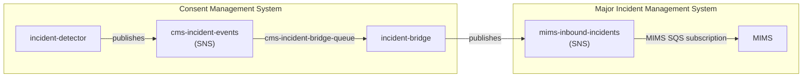
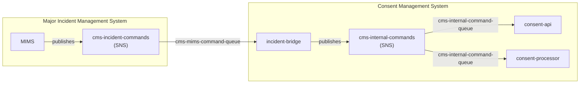
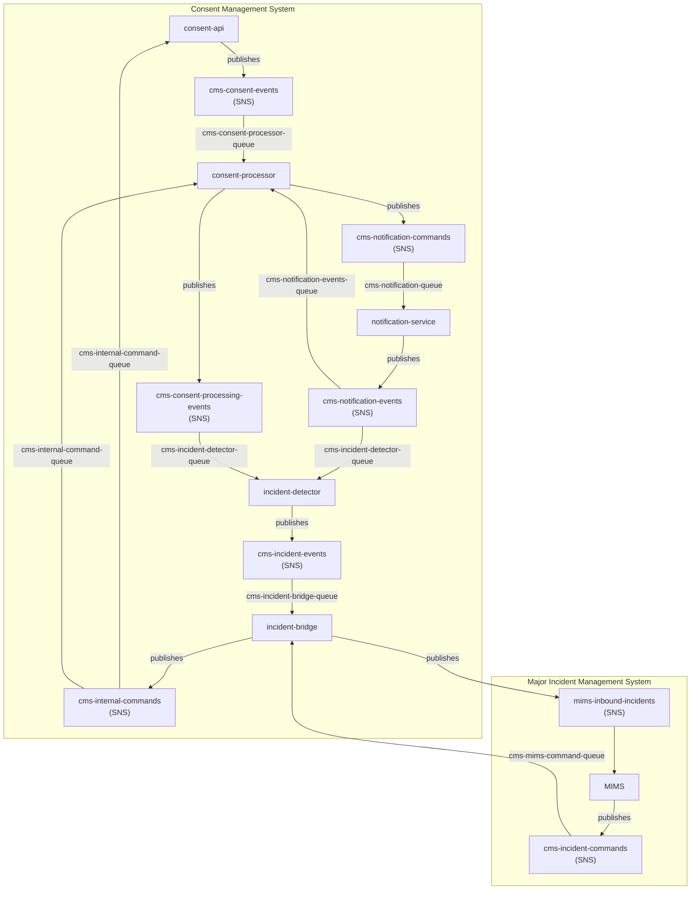
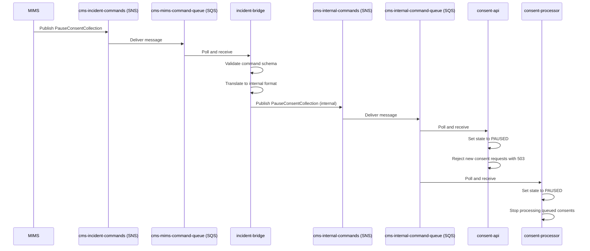
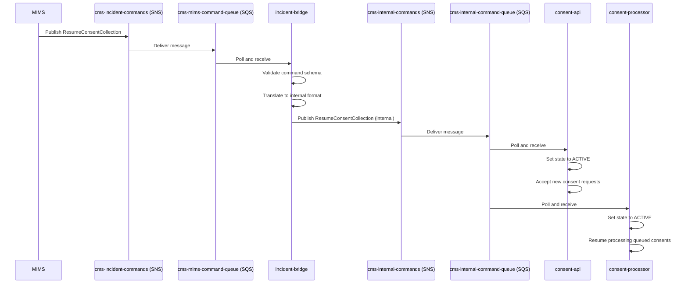

# Consent Management System -- Major Incident Management Integration Design

## Table of Contents

1. [Overview](#1-overview)
2. [Integration Architecture](#2-integration-architecture)
3. [SNS Topics](#3-sns-topics)
4. [SQS Queues](#4-sqs-queues)
5. [Message Schemas](#5-message-schemas)
6. [Incident Detection Rules](#6-incident-detection-rules)
7. [Incident Severity Mapping](#7-incident-severity-mapping)
8. [Command Handling](#8-command-handling)
9. [Retry and Dead Letter](#9-retry-and-dead-letter)
10. [MIMS Integration Contract](#10-mims-integration-contract)

---

## 1. Overview

The Consent Management System (CMS) integrates with an external Major Incident Management System (MIMS) via asynchronous SNS/SQS messaging. The integration provides bidirectional communication between the two systems:

- **CMS to MIMS**: The CMS continuously monitors its own operational health. When the incident-detector component identifies anomalies such as elevated failure rates, throughput drops, or error spikes, it publishes incident events that are forwarded to MIMS for triage and response.
- **MIMS to CMS**: MIMS can send commands back to the CMS to pause or resume consent collection. This allows incident responders to proactively halt consent workflows during known outages or degraded conditions, preventing customer-facing failures while the underlying issue is being resolved.

This design decouples the two systems through SNS topics and SQS queues, ensuring that neither system is directly dependent on the availability of the other. An incident-bridge component sits at the boundary, translating and forwarding messages between the CMS-internal and MIMS-facing topics.

---

## 2. Integration Architecture

The following diagram illustrates the end-to-end message flow between CMS and MIMS.

### CMS to MIMS Flow (Incident Reporting)



### MIMS to CMS Flow (Command Distribution)



### Full System Message Flow



---

## 3. SNS Topics

The integration uses seven SNS topics. Five are internal to the CMS, one is the MIMS-facing inbound topic, and one is published by MIMS.

| # | Topic Name | Description | Publisher(s) | Subscriber(s) |
|---|-----------|-------------|-------------|----------------|
| 1 | `cms-consent-events` | Consent lifecycle events (requested, granted, denied, expired) | consent-api | consent-processor |
| 2 | `cms-notification-commands` | Commands to send notifications to customers | consent-processor | notification-service |
| 3 | `cms-notification-events` | Notification delivery results (sent, failed) | notification-service | consent-processor, incident-detector |
| 4 | `cms-consent-processing-events` | Processing status events from the consent pipeline | consent-processor | incident-detector |
| 5 | `cms-incident-events` | Detected incidents based on monitoring rules | incident-detector | incident-bridge |
| 6 | `mims-inbound-incidents` | Incidents forwarded to MIMS for triage | incident-bridge | MIMS |
| 7 | `cms-incident-commands` | Commands issued by MIMS (pause/resume) | MIMS | incident-bridge |

---

## 4. SQS Queues

Each SNS topic subscription delivers messages to a dedicated SQS queue. Every queue is paired with a dead-letter queue (DLQ) to capture messages that fail processing after the configured number of retries.

### Primary Queues

| # | Queue Name | Source Topic(s) | Consumer | Description |
|---|-----------|----------------|----------|-------------|
| 1 | `cms-consent-processor-queue` | `cms-consent-events` | consent-processor | Receives consent lifecycle events for processing |
| 2 | `cms-notification-queue` | `cms-notification-commands` | notification-service | Receives send-notification commands |
| 3 | `cms-notification-events-queue` | `cms-notification-events` | consent-processor | Receives notification delivery results for status tracking |
| 4 | `cms-incident-detector-queue` | `cms-consent-processing-events`, `cms-notification-events` | incident-detector | Receives processing and notification events for anomaly detection |
| 5 | `cms-incident-bridge-queue` | `cms-incident-events` | incident-bridge | Receives detected incidents for forwarding to MIMS |
| 6 | `cms-mims-command-queue` | `cms-incident-commands` | incident-bridge | Receives commands from MIMS for translation and internal distribution |
| 7 | `cms-internal-command-queue` | cms-internal-commands (published by incident-bridge) | consent-api, consent-processor | Receives translated MIMS commands for internal execution |

### Dead-Letter Queues

| # | DLQ Name | Associated Primary Queue | Max Receive Count |
|---|---------|--------------------------|-------------------|
| 1 | `cms-consent-processor-dlq` | `cms-consent-processor-queue` | 3 |
| 2 | `cms-notification-dlq` | `cms-notification-queue` | 3 |
| 3 | `cms-notification-events-dlq` | `cms-notification-events-queue` | 3 |
| 4 | `cms-incident-detector-dlq` | `cms-incident-detector-queue` | 3 |
| 5 | `cms-incident-bridge-dlq` | `cms-incident-bridge-queue` | 3 |
| 6 | `cms-mims-command-dlq` | `cms-mims-command-queue` | 3 |
| 7 | `cms-internal-command-dlq` | `cms-internal-command-queue` | 3 |

---

## 5. Message Schemas

### Common Event Envelope

All messages across every topic use a common envelope structure. The `event_type` field determines the shape of the `payload` object.

```json
{
  "version": "1.0",
  "event_id": "uuid",
  "event_type": "ConsentRequested",
  "source": "consent-api",
  "timestamp": "ISO8601",
  "correlation_id": "uuid",
  "payload": {}
}
```

| Field | Type | Description |
|-------|------|-------------|
| `version` | string | Schema version. Currently `"1.0"`. |
| `event_id` | string (UUID) | Globally unique identifier for this event. |
| `event_type` | string | Discriminator for the payload shape. |
| `source` | string | The component that published the event. |
| `timestamp` | string (ISO 8601) | When the event was created. |
| `correlation_id` | string (UUID) | End-to-end traceability identifier, propagated across all related events. |
| `payload` | object | Event-type-specific data. |

---

### Consent Lifecycle Events

#### ConsentRequested

Published to `cms-consent-events` when a new consent request is initiated.

```json
{
  "version": "1.0",
  "event_id": "a1b2c3d4-e5f6-7890-abcd-ef1234567890",
  "event_type": "ConsentRequested",
  "source": "consent-api",
  "timestamp": "2026-08-30T14:30:00.000Z",
  "correlation_id": "f47ac10b-58cc-4372-a567-0e02b2c3d479",
  "payload": {
    "consent_id": "cns-20260830-001",
    "customer_id": "cust-9876",
    "channel": "sms",
    "purpose": "marketing_opt_in",
    "contact_info": {
      "phone": "+1-555-0123",
      "email": "customer@example.com"
    }
  }
}
```

#### ConsentGranted

Published to `cms-consent-events` when a customer grants consent.

```json
{
  "version": "1.0",
  "event_id": "b2c3d4e5-f6a7-8901-bcde-f12345678901",
  "event_type": "ConsentGranted",
  "source": "consent-api",
  "timestamp": "2026-08-30T14:35:00.000Z",
  "correlation_id": "f47ac10b-58cc-4372-a567-0e02b2c3d479",
  "payload": {
    "consent_id": "cns-20260830-001",
    "customer_id": "cust-9876",
    "granted_at": "2026-08-30T14:34:55.000Z"
  }
}
```

#### ConsentDenied

Published to `cms-consent-events` when a customer denies consent.

```json
{
  "version": "1.0",
  "event_id": "c3d4e5f6-a7b8-9012-cdef-123456789012",
  "event_type": "ConsentDenied",
  "source": "consent-api",
  "timestamp": "2026-08-30T14:36:00.000Z",
  "correlation_id": "f47ac10b-58cc-4372-a567-0e02b2c3d479",
  "payload": {
    "consent_id": "cns-20260830-001",
    "customer_id": "cust-9876",
    "denied_at": "2026-08-30T14:35:50.000Z",
    "reason": "customer_explicit_refusal"
  }
}
```

#### ConsentExpired

Published to `cms-consent-events` when a consent request expires without a response.

```json
{
  "version": "1.0",
  "event_id": "d4e5f6a7-b8c9-0123-defa-234567890123",
  "event_type": "ConsentExpired",
  "source": "consent-api",
  "timestamp": "2026-08-30T15:00:00.000Z",
  "correlation_id": "f47ac10b-58cc-4372-a567-0e02b2c3d479",
  "payload": {
    "consent_id": "cns-20260830-001",
    "customer_id": "cust-9876",
    "expired_at": "2026-08-30T15:00:00.000Z"
  }
}
```

---

### Notification Events

#### SendNotification

Published to `cms-notification-commands` when a notification must be sent to a customer.

```json
{
  "version": "1.0",
  "event_id": "e5f6a7b8-c9d0-1234-efab-345678901234",
  "event_type": "SendNotification",
  "source": "consent-processor",
  "timestamp": "2026-08-30T14:30:05.000Z",
  "correlation_id": "f47ac10b-58cc-4372-a567-0e02b2c3d479",
  "payload": {
    "consent_id": "cns-20260830-001",
    "customer_id": "cust-9876",
    "channel": "sms",
    "contact_info": {
      "phone": "+1-555-0123"
    },
    "template": "consent_request_sms_v2",
    "response_url": "https://consent.example.com/respond/cns-20260830-001"
  }
}
```

#### NotificationSent

Published to `cms-notification-events` when a notification is successfully delivered.

```json
{
  "version": "1.0",
  "event_id": "f6a7b8c9-d0e1-2345-fabc-456789012345",
  "event_type": "NotificationSent",
  "source": "notification-service",
  "timestamp": "2026-08-30T14:30:08.000Z",
  "correlation_id": "f47ac10b-58cc-4372-a567-0e02b2c3d479",
  "payload": {
    "notification_id": "ntf-20260830-001",
    "consent_id": "cns-20260830-001",
    "channel": "sms",
    "sent_at": "2026-08-30T14:30:07.500Z",
    "provider_message_id": "msg-provider-abc123"
  }
}
```

#### NotificationFailed

Published to `cms-notification-events` when a notification delivery fails.

```json
{
  "version": "1.0",
  "event_id": "a7b8c9d0-e1f2-3456-abcd-567890123456",
  "event_type": "NotificationFailed",
  "source": "notification-service",
  "timestamp": "2026-08-30T14:30:10.000Z",
  "correlation_id": "f47ac10b-58cc-4372-a567-0e02b2c3d479",
  "payload": {
    "notification_id": "ntf-20260830-002",
    "consent_id": "cns-20260830-001",
    "channel": "sms",
    "failed_at": "2026-08-30T14:30:09.800Z",
    "error_code": "CARRIER_UNREACHABLE",
    "error_message": "The destination carrier rejected the message with error 503"
  }
}
```

---

### Incident Events

#### IncidentDetected

Published to `cms-incident-events` when the incident-detector identifies an anomaly.

```json
{
  "version": "1.0",
  "event_id": "b8c9d0e1-f2a3-4567-bcde-678901234567",
  "event_type": "IncidentDetected",
  "source": "incident-detector",
  "timestamp": "2026-08-30T14:45:00.000Z",
  "correlation_id": "d1e2f3a4-b5c6-7890-1234-567890abcdef",
  "payload": {
    "incident_id": "inc-20260830-001",
    "rule_name": "FailureRateRule",
    "severity": "HIGH",
    "description": "Notification failure rate exceeded 60% over the last 15 minutes",
    "metrics": {
      "failure_rate": 0.67,
      "total_notifications": 1500,
      "failed_notifications": 1005,
      "window_minutes": 15
    },
    "detected_at": "2026-08-30T14:44:55.000Z"
  }
}
```

#### IncidentAcknowledged

Published to `cms-incident-commands` by MIMS when an incident is acknowledged by a responder.

```json
{
  "version": "1.0",
  "event_id": "c9d0e1f2-a3b4-5678-cdef-789012345678",
  "event_type": "IncidentAcknowledged",
  "source": "mims",
  "timestamp": "2026-08-30T14:50:00.000Z",
  "correlation_id": "d1e2f3a4-b5c6-7890-1234-567890abcdef",
  "payload": {
    "incident_id": "inc-20260830-001",
    "acknowledged_by": "oncall-engineer@example.com",
    "acknowledged_at": "2026-08-30T14:49:30.000Z"
  }
}
```

#### IncidentResolved

Published to `cms-incident-commands` by MIMS when an incident is resolved.

```json
{
  "version": "1.0",
  "event_id": "d0e1f2a3-b4c5-6789-defa-890123456789",
  "event_type": "IncidentResolved",
  "source": "mims",
  "timestamp": "2026-08-30T15:30:00.000Z",
  "correlation_id": "d1e2f3a4-b5c6-7890-1234-567890abcdef",
  "payload": {
    "incident_id": "inc-20260830-001",
    "resolved_by": "oncall-engineer@example.com",
    "resolved_at": "2026-08-30T15:28:00.000Z",
    "resolution_notes": "Carrier connectivity restored after upstream provider failover completed"
  }
}
```

---

### MIMS Command Events

#### PauseConsentCollection

Published to `cms-incident-commands` by MIMS to pause consent collection in the CMS.

```json
{
  "version": "1.0",
  "event_id": "e1f2a3b4-c5d6-7890-efab-901234567890",
  "event_type": "PauseConsentCollection",
  "source": "mims",
  "timestamp": "2026-08-30T14:51:00.000Z",
  "correlation_id": "d1e2f3a4-b5c6-7890-1234-567890abcdef",
  "payload": {
    "reason": "Elevated notification failure rate detected; pausing to prevent customer impact",
    "scope": "all_channels",
    "initiated_by": "oncall-engineer@example.com",
    "pause_until": "2026-08-30T16:00:00.000Z"
  }
}
```

#### ResumeConsentCollection

Published to `cms-incident-commands` by MIMS to resume consent collection after a pause.

```json
{
  "version": "1.0",
  "event_id": "f2a3b4c5-d6e7-8901-fabc-012345678901",
  "event_type": "ResumeConsentCollection",
  "source": "mims",
  "timestamp": "2026-08-30T15:35:00.000Z",
  "correlation_id": "d1e2f3a4-b5c6-7890-1234-567890abcdef",
  "payload": {
    "reason": "Incident inc-20260830-001 resolved; carrier connectivity restored",
    "initiated_by": "oncall-engineer@example.com"
  }
}
```

---

## 6. Incident Detection Rules

The incident-detector component evaluates incoming processing and notification events against a set of configurable rules. When a rule triggers, an `IncidentDetected` event is published.

| Rule Name | Condition | Window | Severity | Description |
|-----------|-----------|--------|----------|-------------|
| `FailureRateRule` | Notification failure rate > 30% | 15 minutes | MEDIUM (>30%), HIGH (>60%) | Monitors the ratio of `NotificationFailed` events to total notification events. Escalates to HIGH severity when the failure rate exceeds 60%. |
| `ThroughputDropRule` | Consent processing throughput < 50% of baseline | 10 minutes | MEDIUM | Compares the current rate of `cms-consent-processing-events` against a rolling baseline. Triggers when throughput drops below half of the expected volume. |
| `ErrorSpikeRule` | Error count > 3x rolling average | 5 minutes | HIGH | Counts error events across all processing and notification topics. Triggers when the count in the current window exceeds three times the rolling average. |

### Rule Evaluation Details

1. **FailureRateRule**: The detector maintains a sliding window of 15 minutes. It counts all `NotificationSent` and `NotificationFailed` events within the window. The failure rate is calculated as `failed / (sent + failed)`. If the rate exceeds 0.30, a MEDIUM severity incident is raised. If it exceeds 0.60, the severity is escalated to HIGH.

2. **ThroughputDropRule**: A rolling baseline is computed from the previous 24 hours of `cms-consent-processing-events` throughput, segmented by hour-of-day to account for natural traffic patterns. The detector compares the current 10-minute throughput against the expected value. If it falls below 50%, a MEDIUM incident is raised.

3. **ErrorSpikeRule**: The detector tracks all error-category events (e.g., `NotificationFailed`, processing errors) over a 5-minute sliding window. The rolling average is computed from the previous 1 hour of data. If the current count exceeds 3x the average, a HIGH severity incident is raised.

---

## 7. Incident Severity Mapping

Incident severities in CMS map to MIMS priority levels as follows:

| CMS Severity | Description | Response Expectation | MIMS Priority |
|-------------|-------------|---------------------|---------------|
| LOW | Minor issues, informational only | No immediate action required; review during business hours | P4 |
| MEDIUM | Degraded service, partial impact on consent workflows | Needs attention within 4 hours | P3 |
| HIGH | Significant impact on consent collection or notification delivery | Needs attention within 1 hour | P2 |
| CRITICAL | Service is down, consent collection fully halted | Immediate response required | P1 |

### Escalation Behavior

- When an incident is first detected, it is assigned a severity based on the triggering rule.
- If conditions worsen (e.g., a `FailureRateRule` MEDIUM incident escalates because the failure rate crosses 60%), a new `IncidentDetected` event is published with the updated severity and a reference to the original `incident_id`.
- MIMS is responsible for managing escalation workflows, paging, and notification of on-call responders according to its own priority-to-response mapping.

---

## 8. Command Handling

When MIMS determines that consent collection should be paused or resumed, it publishes a command to the `cms-incident-commands` SNS topic. The following describes the end-to-end command flow.

### PauseConsentCollection Flow



### ResumeConsentCollection Flow



### Command Processing Details

1. **Message arrival**: MIMS publishes a `PauseConsentCollection` or `ResumeConsentCollection` event to the `cms-incident-commands` SNS topic.
2. **Queue delivery**: The message is delivered to the `cms-mims-command-queue` SQS queue.
3. **Bridge processing**: The incident-bridge component polls the queue, validates the message against the expected schema, and verifies that the `event_type` is a recognized command.
4. **Internal distribution**: The incident-bridge publishes the validated command to the internal CMS topic. This decouples the external MIMS interface from internal CMS components.
5. **Consumer execution**: Both consent-api and consent-processor receive the command via the `cms-internal-command-queue` and update their operational state accordingly.
6. **State transitions**:
   - On `PauseConsentCollection`: consent-api begins returning HTTP 503 for new consent requests; consent-processor halts processing of queued consent events.
   - On `ResumeConsentCollection`: consent-api resumes accepting requests; consent-processor resumes queue consumption.
7. **Idempotency**: Receiving a `PauseConsentCollection` when already paused, or a `ResumeConsentCollection` when already active, is a no-op. Components log the duplicate command but take no further action.

---

## 9. Retry and Dead Letter

### Retry Configuration

Each SQS queue is configured with a redrive policy that sends messages to a dead-letter queue after repeated processing failures.

| Parameter | Value | Description |
|-----------|-------|-------------|
| `maxReceiveCount` | 3 | Maximum number of times a message can be received before it is moved to the DLQ |
| `visibilityTimeout` | 30 seconds | Time a message is hidden from other consumers after being received |
| `messageRetentionPeriod` | 14 days (DLQ) | How long messages are retained in the dead-letter queue |

### Retry Behavior

1. A consumer receives a message from the queue.
2. If processing fails, the consumer does not delete the message. After the `visibilityTimeout` expires, the message becomes visible again.
3. On the next receive, SQS increments the `ApproximateReceiveCount` for the message.
4. After the message has been received 3 times without successful deletion, SQS automatically moves it to the associated DLQ.

### DLQ Monitoring and Alerting

Dead-letter queues must be monitored to detect persistent failures:

- **CloudWatch Alarm**: An alarm is configured on the `ApproximateNumberOfMessagesVisible` metric for each DLQ. The alarm triggers when the count exceeds 0 for more than 5 minutes.
- **Alert Routing**: DLQ alarms are routed to the operations team via the existing alerting pipeline.
- **Dashboard**: A CloudWatch dashboard displays DLQ depth for all seven queues in a single view.

### Manual Reprocessing Procedure

When messages land in a DLQ, they must be investigated and reprocessed:

1. **Inspect**: Use the AWS Console or CLI to inspect messages in the DLQ. Examine the message body and attributes to determine the cause of failure.
   ```bash
   aws sqs receive-message \
     --queue-url https://sqs.us-east-1.amazonaws.com/123456789012/cms-consent-processor-dlq \
     --max-number-of-messages 10 \
     --visibility-timeout 0
   ```

2. **Diagnose**: Identify the root cause. Common causes include malformed messages, downstream service outages, or schema mismatches.

3. **Fix**: Address the underlying issue (deploy a fix, restore downstream service, etc.).

4. **Replay**: Use the SQS DLQ redrive feature to move messages back to the source queue for reprocessing.
   ```bash
   aws sqs start-message-move-task \
     --source-arn arn:aws:sqs:us-east-1:123456789012:cms-consent-processor-dlq \
     --destination-arn arn:aws:sqs:us-east-1:123456789012:cms-consent-processor-queue
   ```

5. **Verify**: Monitor the source queue and application logs to confirm messages are processed successfully.

6. **Purge**: If messages are determined to be invalid and should not be reprocessed, purge them from the DLQ after documenting the decision.
   ```bash
   aws sqs purge-queue \
     --queue-url https://sqs.us-east-1.amazonaws.com/123456789012/cms-consent-processor-dlq
   ```

---

## 10. MIMS Integration Contract

The external Major Incident Management System must adhere to the following contract for successful integration with the CMS.

### Requirements

1. **Subscribe to incident notifications**: MIMS must create an SQS queue and subscribe it to the `mims-inbound-incidents` SNS topic. This is the sole channel through which MIMS receives incident reports from the CMS.

2. **Publish commands to the correct topic**: MIMS must publish `PauseConsentCollection`, `ResumeConsentCollection`, `IncidentAcknowledged`, and `IncidentResolved` commands to the `cms-incident-commands` SNS topic.

3. **Follow the event envelope schema**: All messages published by MIMS must conform to the common event envelope defined in [Section 5](#5-message-schemas). Specifically:
   - `version` must be `"1.0"`.
   - `event_id` must be a unique UUID for each message.
   - `event_type` must be one of the recognized command types.
   - `source` must be `"mims"`.
   - `timestamp` must be a valid ISO 8601 string.
   - `correlation_id` must be included for traceability. When responding to a CMS-originated incident, the `correlation_id` from the original `IncidentDetected` event should be reused.
   - `payload` must match the schema for the specified `event_type`.

4. **Include correlation_id for traceability**: Every command published by MIMS must include a `correlation_id` that links back to the original incident or operational context. This enables end-to-end tracing across both systems.

### Authentication and Authorization

- SNS topic access is controlled via IAM policies. MIMS must use an IAM role or user with `sns:Publish` permission on the `cms-incident-commands` topic ARN.
- The `mims-inbound-incidents` topic policy must grant `sns:Subscribe` and `sqs:SendMessage` permissions to the MIMS account.

### Message Ordering and Idempotency

- SNS/SQS does not guarantee strict ordering. MIMS should not assume that events arrive in the order they were published.
- MIMS should treat CMS events idempotently. Duplicate `IncidentDetected` events for the same `incident_id` may arrive if the detector re-evaluates a persisting condition.
- CMS treats MIMS commands idempotently. Sending `PauseConsentCollection` when the system is already paused is safe and will not cause errors.

### Topic ARNs

| Topic | ARN Pattern |
|-------|-------------|
| `mims-inbound-incidents` | `arn:aws:sns:{region}:{cms-account-id}:mims-inbound-incidents` |
| `cms-incident-commands` | `arn:aws:sns:{region}:{cms-account-id}:cms-incident-commands` |

### Health Check

MIMS can verify connectivity by publishing a no-op message with `event_type: "Ping"` to `cms-incident-commands`. The incident-bridge will log the message and discard it without further action. This can be used for integration testing and periodic health verification.
